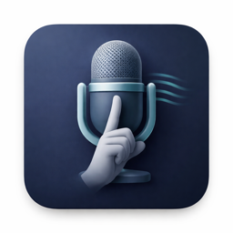
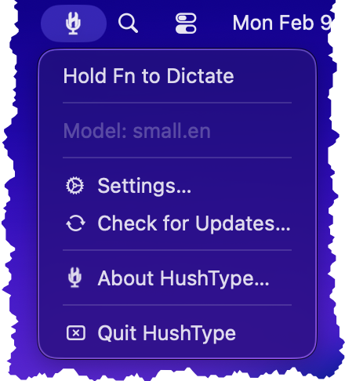
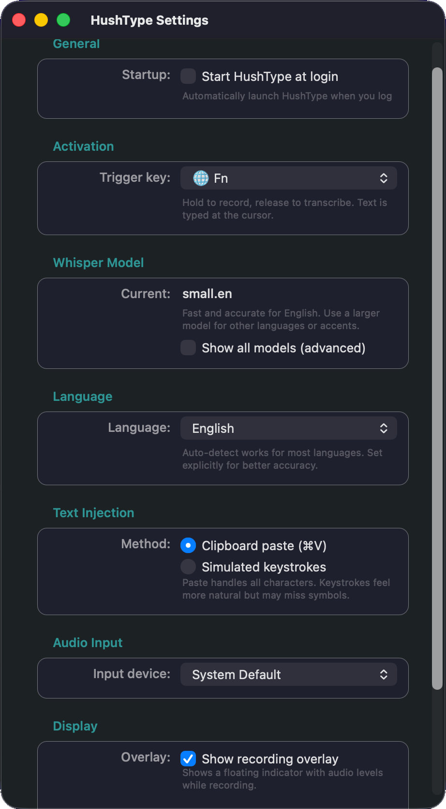

<div align="center">



# HushType

**Private, on-device speech-to-text dictation for macOS.**

Hold a key, speak, release — your words are typed into whatever app you're using. No cloud, no accounts, no data ever leaves your Mac.

[](https://github.com/malcolmct/HushType/releases/latest)
[](https://github.com/malcolmct/HushType/releases/latest)
[](https://github.com/malcolmct/HushType/releases/latest)
[](LICENSE)

[**⬇ Download**](https://github.com/malcolmct/HushType/releases/latest) &nbsp;·&nbsp; [**📖 User Guide**](HushType-User-Guide.pdf)

</div>

---

## What is HushType?

HushType is a lightweight macOS **menu-bar app** that turns your speech into text — entirely **on-device**. Press and hold a configurable key (the **Fn** key by default), speak, and release. HushType transcribes what you said and types it straight into the app you're working in: your editor, browser, chat window, email — anywhere.

All transcription runs locally on your Mac's Neural Engine using [WhisperKit](https://github.com/argmaxinc/WhisperKit) (OpenAI's Whisper model compiled for Apple's CoreML). **Nothing is sent to the internet.** There's no sign-up, no subscription, and no telemetry.

## Why HushType?

- 🔒 **Completely private** — 100% on-device inference. Your voice and text never leave your Mac.
- ⚡ **Fast & always ready** — the speech model is bundled with the app, so it works instantly and offline, even on first launch.
- 🎯 **Works everywhere** — dictate into any application; the text is typed exactly where your cursor is.
- 🌍 **Multilingual** — transcribe in 30 languages, or let it auto-detect.
- 🪶 **Stays out of your way** — lives quietly in the menu bar, no dock icon.
- 🆓 **Free** — no accounts, no subscriptions.

## Screenshots

<div align="center">

| Menu bar | Settings |
|:--:|:--:|
|  |  |

</div>

## Requirements

- **macOS 14.0 (Sonoma)** or later
- **Apple Silicon** (M1 or newer) — Intel Macs are not supported, as on-device transcription relies on the Neural Engine

## Installation

1. **Download** the latest `HushType.dmg` from the [**Releases page**](https://github.com/malcolmct/HushType/releases/latest).
2. **Open** the downloaded DMG and **drag HushType** into your **Applications** folder.
3. **Launch** HushType from Applications. It appears in your **menu bar** (top-right of the screen) — there is no dock icon.
4. **Grant permissions** when prompted (see below). HushType is code-signed and notarised by Apple, so it opens without security warnings.

### Permissions

On first launch, HushType shows a permissions window. Two are required:

| Permission | Why it's needed |
|---|---|
| 🎙️ **Microphone** | To capture your speech for transcription |
| ♿ **Accessibility** | To type the transcribed text into other apps |

A third, **App Management**, is optional — it lets automatic updates install smoothly. You can grant it later if needed.

> **Tip:** After adding HushType to the Accessibility list, if it isn't recognised immediately, use the **Restart HushType** button in the permissions window — macOS caches this permission per app session.

## Usage

1. Place your cursor where you want text to appear (any app).
2. **Press and hold** the trigger key — **Fn** by default. A small overlay shows it's recording.
3. **Speak** naturally.
4. **Release** the key. HushType transcribes and types your words at the cursor.

That's it. For best results, speak in complete phrases and release the key when you're done.

## Settings

Open **Settings** from the menu bar icon to configure:

- **Trigger key** — choose **Fn**, **Control**, or **Option** for push-to-talk
- **Language** — 30 languages, or auto-detect
- **Whisper model** — the bundled `small.en` is recommended for English; larger models offer higher accuracy
- **Text injection** — paste mode (default, most reliable) or simulated keystrokes
- **Audio input** — pick which microphone to use
- **Display** — toggle the recording overlay and choose the menu-bar icon style
- **Start at login** — launch HushType automatically when you log in

📖 See the full [**User Guide**](HushType-User-Guide.pdf) for detailed walkthroughs of every option (also included inside the DMG).

## Automatic Updates

HushType keeps itself up to date using [Sparkle](https://sparkle-project.org). Updates are cryptographically signed and delivered securely — choose **Check for Updates…** from the menu, or let HushType notify you when a new version is available.

## Speech Models

HushType ships with the `small.en` model, a good balance of speed and accuracy for English. You can switch models in Settings; from fastest to most accurate:

| Model | Notes |
|---|---|
| `tiny` / `tiny.en` | Fastest, lowest accuracy |
| `base` / `base.en` | Fast, reasonable accuracy |
| `small` / **`small.en`** | **Default** — recommended for English |
| `medium` / `medium.en` | Higher accuracy, slower |
| `large-v3` | Best accuracy, most memory |
| `large-v3-turbo` | Distilled large model, faster than full large |

Non-English models are downloaded on demand from [Hugging Face](https://huggingface.co/argmaxinc/whisperkit-coreml); English defaults are bundled for instant, offline use.

## Building from Source

HushType is built with **Swift Package Manager** (no Xcode project required).

```bash
# Clone the repo
git clone https://github.com/malcolmct/HushType.git
cd HushType

# Build the app bundle (ad-hoc signed, for local use)
./build-app.sh

# Run it
open HushType.app
```

**Prerequisites:** Xcode 15+ (Swift 5.9 toolchain), macOS 14+ SDK, and an Apple Silicon Mac.

Dependencies ([WhisperKit](https://github.com/argmaxinc/WhisperKit) and [Sparkle](https://sparkle-project.org)) are resolved automatically by SPM.

## Acknowledgements

HushType is built on excellent open-source work:

- **[WhisperKit](https://github.com/argmaxinc/WhisperKit)** by Argmax, Inc. — CoreML Whisper inference (MIT License)
- **[OpenAI Whisper](https://github.com/openai/whisper)** — the underlying speech recognition model (MIT License)
- **[Sparkle](https://sparkle-project.org)** — secure macOS app updates

## License

HushType is released under the [MIT License](LICENSE) — you're free to use, copy, modify, and distribute it. © 2026 Malcolm Taylor.

It also bundles the open-source components listed above under their respective licenses; full license texts are shown in the app's **About** window.
